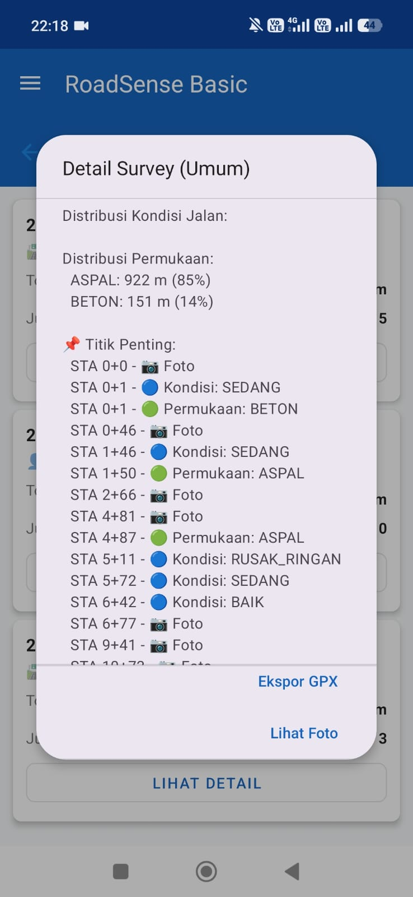

# 🚧 RoadSenseBasic
Digital Pavement Condition Survey & PCI Engine for Android

A field-ready prototype for mobile road condition assessment and Pavement Management System (PMS) research.  
Built as a foundation toward scalable digital pavement management solutions.

---

## 📸 Application Preview

### 📊 Survey Detail & Condition Distribution

  

> Example of real survey session output with automatic condition aggregation.

This screen demonstrates:
- Surface distribution statistics (Asphalt vs Concrete)
- Segment-based condition classification (BAIK, SEDANG, RUSAK_RINGAN)
- Important survey points with photo documentation
- GPX export capability

---

## 🌍 Why This Project Matters

Road infrastructure monitoring in many developing regions still relies on manual surveys and fragmented reporting systems.

RoadSenseBasic provides a lightweight, mobile-first digital solution for:

- Pavement Condition Index (PCI) calculation
- Surface Distress Index (SDI) evaluation
- Road segment-based condition tracking
- Field survey digitization

This project serves as a prototype toward a smarter and more scalable Pavement Management System (PMS).

📌 Key Features
🗺️ GPS-Based Road Survey

Real-time GPS tracking

Road segment mapping

Survey session recording

Foreground service for continuous tracking

📊 Pavement Condition Index (PCI)

Distress type classification

Distress severity input

Automatic PCI calculation engine

Segment-based PCI aggregation

📉 Surface Distress Index (SDI)

Automated SDI computation

Integrated survey engine

Road condition categorization

🧮 Calculation Engine

Modular PCI calculator

SDI computation module

Domain-layer separation

Extensible evaluation logic

🗄️ Local Database (Room)

Versioned schema migration

RoadSegment entity

Distress entities

Survey session management

📄 Export & Reporting

PDF export capability

File exporter utility

Survey summary dashboard

🧠 Core Strengths

Field-ready architecture designed for real-time survey workflow

Modular PCI & SDI computation engine

Database schema versioning for data consistency

Clear separation between UI, domain logic, and persistence layer

📘 Engineering Context

The Pavement Condition Index (PCI) method is widely used to assess road surface performance based on distress type, severity, and density.
This application digitizes the evaluation process and integrates it with segment-based road tracking and automated computation.

🏗️ Architecture

This project follows a clean layered architecture:

UI Layer
   ↓
ViewModel
   ↓
Repository
   ↓
Domain Engine (PCI / SDI)
   ↓
Room Database
Technologies Used

Kotlin

Android Jetpack

Room Database

Foreground Service

MVVM Architecture

📂 Project Structure Overview
data/
 ├── local/
 │    ├── dao/
 │    ├── entity/
 │    └── RoadSenseDatabase.kt

domain/
 └── engine/
      ├── Pcicalculator.kt
      └── SDICalculator.kt

ui/
 ├── map/
 ├── distress/
 └── summary/
🎯 Target Use Cases

Road infrastructure monitoring

Pavement condition surveys

Local government field inspection

Academic research (Urban Planning / Civil Engineering)

Smart road inspection prototype development

📱 Minimum Requirements

Android 8.0+

GPS enabled

Storage permission for report export

🚀 Future Development

Cloud synchronization (Firebase / backend API)

GIS integration

Multi-user survey system

Analytical dashboard

Web-based monitoring panel

📌 Project Status

🟢 Active Development

Schema Version: v9

PCI Engine: Implemented

SDI Engine: Implemented

PDF Export: Available

Map Data & Attribution

This application uses map data from OpenStreetMap.

© OpenStreetMap contributors  
https://www.openstreetmap.org

OpenStreetMap data is licensed under the Open Database License (ODbL).

⚠ Disclaimer

This application is a research and development prototype.
It is not intended for official engineering decisions without proper validation and calibration.

👨‍💻 Author

Developed by Hatta
saungdaun@gmail.com
Road Infrastructure & Urban Planning Enthusiast
