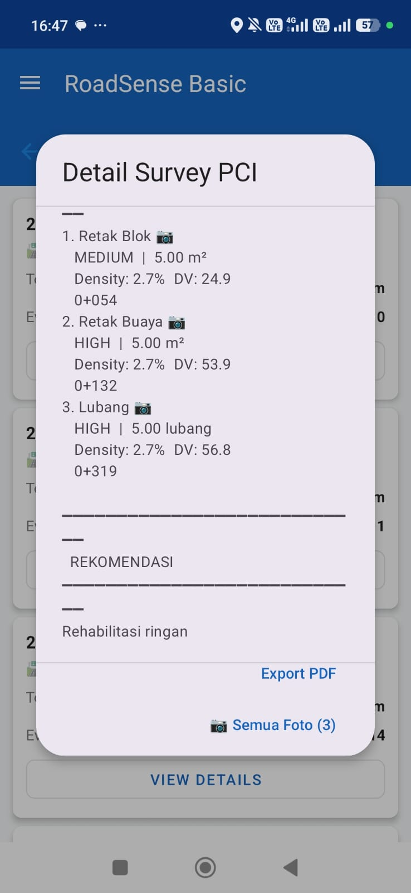
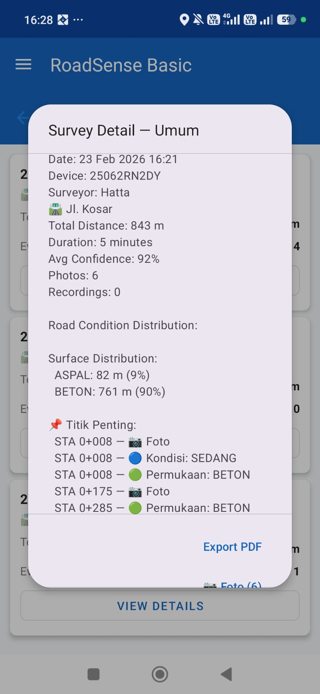
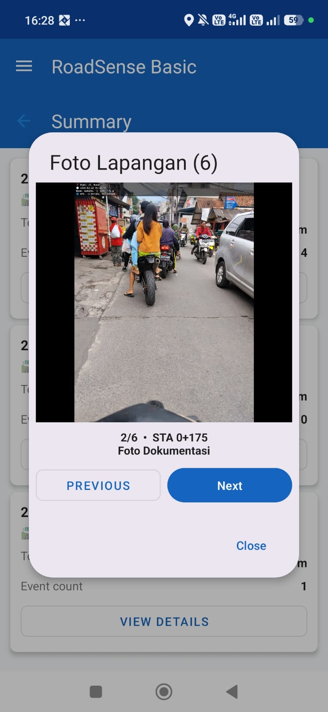
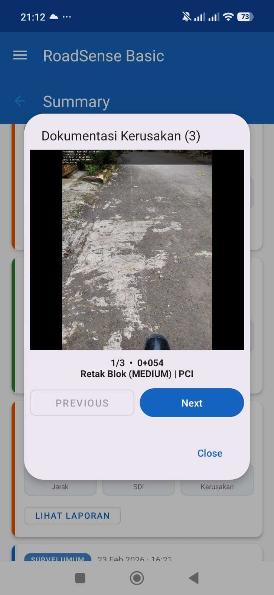
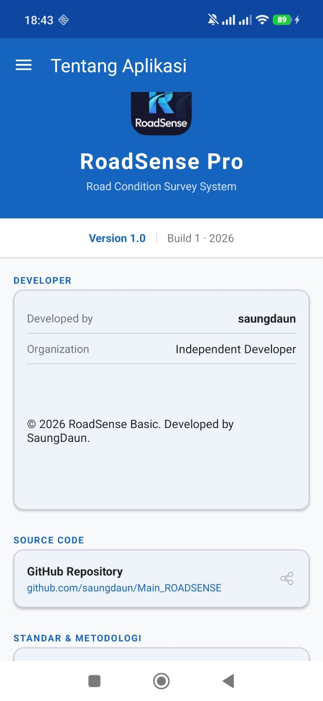
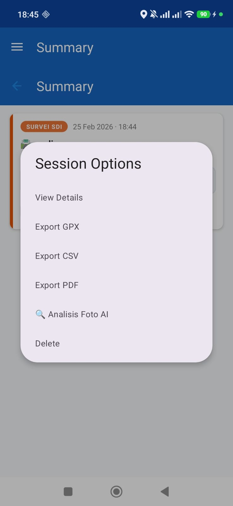

🚧 RoadSenseBasic

An Android-based field survey system for digitizing Pavement Condition Index (PCI) and Surface Distress Index (SDI) evaluation toward scalable Pavement Management Systems (PMS).
Designed for real-world field deployment in developing infrastructure environments.

A field-ready prototype for mobile road condition assessment and Pavement Management System (PMS) research.  
Built as a foundation toward scalable digital pavement management solutions.

📸 Application Preview

🗺 **Field Survey, Mapping & PCI Evaluation**

  
  
  
  
  
  

We invite practitioners, researchers, and developers to participate in the field testing program of RoadSenseBasic.

By joining as a beta tester, you will:

✅ Evaluate PCI/SDI accuracy under real road conditions

✅ Provide direct feedback to improve system features

✅ Gain early access to upcoming enhancements

✅ Contribute to research in digital pavement management systems

📋 Apply here: https://forms.gle/9CoMia6oDdd379fn6

💬 Discussion & feedback: https://github.com/saungdaun/Main_ROADSENSE/discussions

⭐ Star the repository to stay updated with future developments

🌍 Why This Project Matters

Road infrastructure monitoring in many developing regions still relies on manual surveys and fragmented reporting systems.

RoadSenseBasic provides a lightweight, mobile-first digital solution for:

- Pavement Condition Index (PCI) calculation
- Surface Distress Index (SDI) evaluation
- Road segment-based condition tracking
- Field survey digitization

This project serves as a prototype toward a smarter and more scalable Pavement Management System (PMS).

📌 Key Features

1️⃣ GPS-Based Road Survey
- Real-time GPS tracking
- Road segment mapping
- Continuous foreground tracking service

2️⃣ Surface & Distress Recording
- Surface distribution (Asphalt / Concrete)
- Segment-based condition classification
- Photo documentation per STA

3️⃣ Automated PCI Engineering Output
- PCI score (0–100 scale)
- Condition categorization
- Recommended treatment logic
- Segment-level breakdown
- PDF export capability

🧠 Core Strengths
- Field-ready architecture designed for real-time survey workflow
- Modular PCI & SDI computation engine
- Database schema versioning for data consistency
- Clear separation between UI, domain logic, and persistence layer

📘 Engineering Context

The Pavement Condition Index (PCI) method is widely used to assess road surface performance based on distress type, severity, and density.  
This application digitizes the evaluation process and integrates it with segment-based road tracking and automated computation.

🏗️ Architecture

This project follows a clean layered architecture:
UI Layer
↓
ViewModel
↓
Repository
↓
Domain Engine (PCI / SDI)
↓
Room Database

Technologies Used:

- Kotlin
- Android Jetpack
- Room Database
- Foreground Service
- MVVM Architecture

📂 Project Structure Overview

data/
 ├── local/
 │   ├── dao/
 │   ├── entity/
 │   └── RoadSenseDatabase.kt

domain/
 └── engine/
     ├── Pcicalculator.kt
     └── SDICalculator.kt

ui/
 ├── map/
 ├── distress/
 └── summary/

🎯 Target Use Cases

- Road infrastructure monitoring
- Pavement condition surveys
- Local government field inspection
- Academic research (Urban Planning / Civil Engineering)
- Smart road inspection prototype development

📱 Minimum Requirements

- Android 8.0+
- GPS enabled
- Storage permission for report export

🧭 RoadSense Ecosystem Vision

**RoadSenseBasic** is the foundation of a broader digital pavement management ecosystem:

- **RoadSenseBasic** – Mobile survey engine (open-source)
- **RoadSensePro** – Advanced analytics & cloud dashboard (planned)
- **RoadSenseCloud** – Centralized PMS monitoring system (future vision)

This repository represents the mobile survey core.

📺 Demo Video:
https://youtube.com/shorts/Sfvw6FEV6k4

🚀 Future Development

- Cloud synchronization (Firebase / backend API)
- GIS integration
- Multi-user survey system
- Analytical dashboard
- Web-based monitoring panel

📊 Validation Roadmap

Planned validation:
- Comparative testing against manual PCI survey
- Multi-device accuracy testing
- Calibration across different road classes//taruh dimana

📌 Project Status

🟢 **Active Development**  
Schema Version: `v9`  
PCI Engine: Implemented  
SDI Engine: Implemented  
PDF Export: Available  

---

🗺️ Map Data & Attribution

This application uses map data from OpenStreetMap.

© OpenStreetMap contributors  
[https://www.openstreetmap.org](https://www.openstreetmap.org)

OpenStreetMap data is licensed under the Open Database License (ODbL).

---

⚠ Disclaimer

This application is a research and development prototype.  
It is not intended for official engineering decisions without proper validation and calibration.

📖 Citation

If you use this project for research, please cite:

> Hatta (2026). RoadSenseBasic: Digital Pavement Condition Survey & PCI Engine for Android. GitHub Repository.

👨‍💻 Author

Developed by **Hatta Zaujaani**  
📧 saungdaun@gmail.com  
Road Infrastructure & Urban Planning Enthusiast
